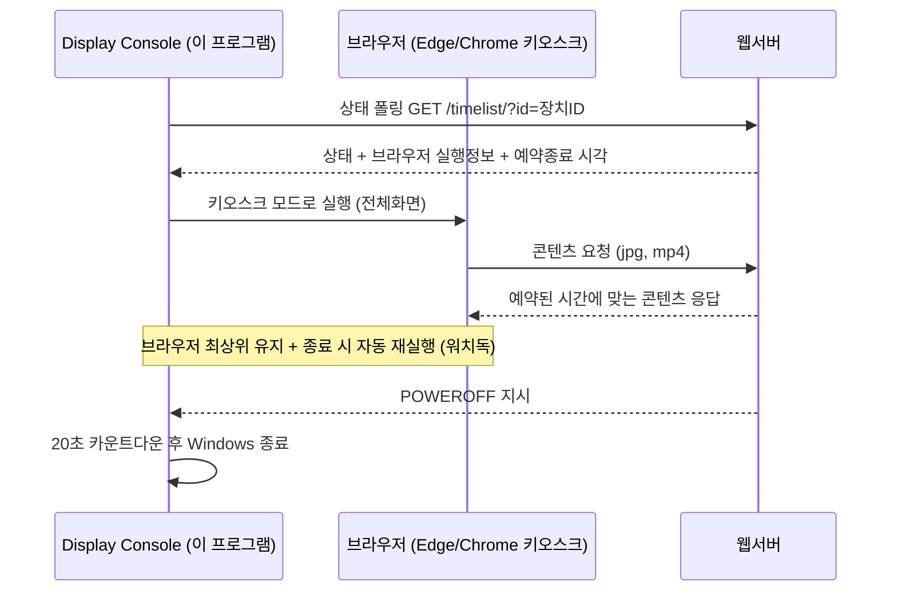

# Digital Signage Player (Desktop)

디스플레이(모니터)에 콘텐츠를 재생하는 **Windows용 디지털 사이니지 플레이어**입니다.
학교, 매장, 엘리베이터, 버스·지하철역, 옥외 LED 전광판 등 상시 운영되는 디스플레이 환경을 위해 만들어졌습니다.
Delphi(VCL)로 개발되었으며, 브라우저를 키오스크 모드로 띄워 웹서버의 콘텐츠(jpg, mp4)를 전체화면으로 재생하고, 서버와 통신하며 예약 재생·원격 제어·예약 종료를 수행합니다.

> Windows desktop digital signage player — launches a browser in kiosk mode, keeps it on top, and handles scheduled content & power-off via server polling. Built with Delphi (VCL).

## 동작 개요

이 프로그램은 콘텐츠를 직접 그리지 않습니다. 콘텐츠 재생은 웹 페이지가 담당하고, 이 프로그램은 그 페이지를 안정적으로 계속 띄워두는 **키오스크 관리자(supervisor)** 역할을 합니다.



- **콘텐츠 재생** — 웹서버가 장치 ID별 페이지를 제공하고, 예약된 시간에 맞는 콘텐츠(jpg, mp4)를 내려줍니다.
- **전원 켜기** — 프로그램이 아닌 PC의 CMOS(BIOS) 예약 부팅으로 처리합니다.
- **전원 끄기** — 서버가 지시하면 이 프로그램이 카운트다운 후 Windows를 종료합니다.

## 주요 기능

- **브라우저 키오스크 실행** — Edge/Chrome을 전체화면 키오스크 모드로 실행합니다. 실행할 브라우저 경로와 파라미터(`--kiosk`, `--autoplay-policy=no-user-gesture-required` 등)는 서버 응답으로 내려받아 원격에서 변경할 수 있습니다.
- **최상위(TopMost) 유지** — 현장 PC에 설치된 타 프로그램(메신저 등)이 디스플레이 위로 올라오는 것을 막기 위해, 주기적으로 키오스크 브라우저 창을 최상위로 고정합니다.
- **워치독(자동 재실행)** — 브라우저 창이 사라지면(강제 종료 등) 자동으로 다시 실행합니다.
- **서버 상태 폴링** — 주기적으로 서버 상태를 확인하여 원격 명령(종료/재부팅/새로고침/중지)을 수행하고, 완료 시 서버에 보고합니다.
- **예약 전원 종료** — 서버가 `POWEROFF`를 지시하면 20초 카운트다운 화면을 표시한 뒤 Windows를 종료합니다. 카운트다운 중 현장에서 취소할 수 있습니다.
- **시작프로그램 등록** — 설정에서 Windows 시작 시 자동 실행(HKCU Run 레지스트리)을 켜고 끌 수 있습니다.
- **관리 콘솔 호출 핫키** — 전체화면 재생 중 `Ctrl + Q`를 누르면 관리 콘솔 창이 나타납니다.
- **동작 로그** — 실행/설정/종료 등 주요 이벤트를 로그 파일로 남깁니다.

## 서버 통신

### 상태 폴링

```
GET {서버}/timelist/?id={장치ID}
```

응답은 줄 단위 텍스트입니다.

| 줄 | 내용 |
|---|---|
| 1 | 서버가 배포하는 버전 정보 |
| 2 | 상태 코드 (아래 표 참고) |
| 3 | 실행할 브라우저 경로 |
| 4 | 브라우저 실행 파라미터 (키오스크 URL 포함) |
| 5 | 옵션 플래그 (`;HIDE_CREATOR;` 등) |
| 6~ | 예약 전원종료 시각 목록 (로컬 설정에 저장됨) |

### 상태 코드

| 상태 | 동작 |
|---|---|
| `ACTIVE` | 정상 — 최초 1회 키오스크 브라우저 실행 |
| `POWEROFF` | 20초 카운트다운 후 Windows 종료 |
| `TASK_SHUTDOWN` | 즉시 Windows 종료 (완료 보고 후) |
| `TASK_REBOOT` | 즉시 Windows 재부팅 (완료 보고 후) |
| `TASK_RELOAD` | 브라우저 최상위 해제 및 재로드 |
| `TASK_STOP` | 프로그램 종료 |
| `NOT_FOUND` | 등록되지 않은 장치 ID — 폴링 중단, 오류 표시 |

### 작업 완료 보고

```
GET {서버}/task/?id={장치ID}&task=done
```

## 설정 및 로그

| 항목 | 경로 |
|---|---|
| 설정 파일 | `%APPDATA%\webchon\console_config.ini` |
| 로그 파일 | `%APPDATA%\webchon\logs.txt` |

설정 파일 주요 항목:

```ini
[App]
ID=장치ID            ; 서버에 등록된 장치(고객) ID
Version=...          ; 서버에서 내려받은 버전 정보
LAST_UPDATE=...      ; 마지막 설정 저장 시각

[POWEROFF]
RESERVE1=...         ; 서버에서 내려받은 예약 종료 시각
RESERVE2=...
```

## 다운로드

[Releases](https://github.com/real21c/digital-signage-player-desktop/releases/latest)에서 `DisplayConsole-<버전>-win64-portable.exe`를 받아 바로 실행합니다. 설치가 필요 없습니다.

## 사용 방법

1. 프로그램을 실행하면 **SETTINGS** 화면이 열립니다.
2. **장치 ID**를 입력하고, 시작프로그램 등록 여부(YES/NO)를 선택한 뒤 **저장**합니다.
3. 저장하면 서버와 동기화가 시작되고, 상태가 `ACTIVE`이면 키오스크 브라우저가 자동 실행됩니다.
4. 전체화면 재생 중 관리가 필요하면 `Ctrl + Q`로 콘솔을 호출합니다.

## 빌드

| 항목 | 값 |
|---|---|
| 개발 도구 | Delphi 12 (RAD Studio), VCL |
| 대상 플랫폼 | Windows 64bit |
| 메인 프로젝트 | `display.dproj` |

RAD Studio에서 `display.dproj`를 열고 `Win64` 플랫폼으로 빌드합니다. 외부 라이브러리 의존성은 없습니다(표준 VCL + `System.Net.HttpClient`).

### 프로젝트 구성

| 파일 | 설명 |
|---|---|
| `display.dpr` / `display.dproj` | 메인 프로젝트 |
| `DC.dpr`, `now100kDisplayStartup.dpr` | 동일 소스를 공유하는 빌드 변형(실행파일명 차이) |
| `unitMain.pas` / `.dfm` | 메인 폼 — 콘솔 UI, 서버 폴링, 키오스크 제어, 전원 관리 |
| `unitCommon.pas` | 공통 유틸 — 레지스트리(시작프로그램), INI 설정, 종료 권한 |
| `unitTemp.pas` / `.dfm` | 보조 폼 |

## 제작

**Display Console** © Dongmin Kim (now100k studio) · [real21c@gmail.com](mailto:real21c@gmail.com)
